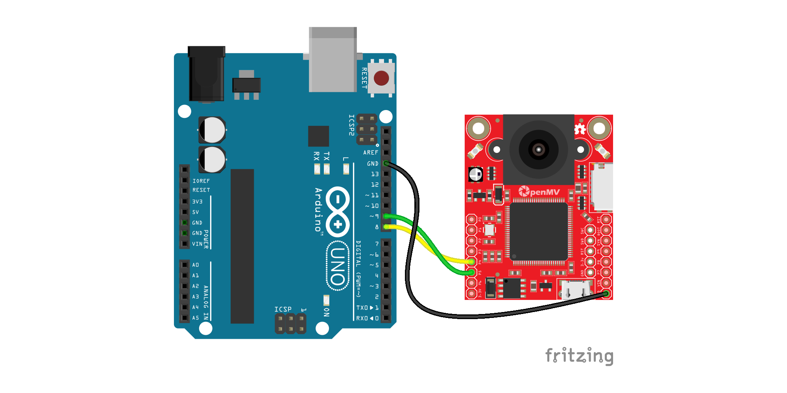
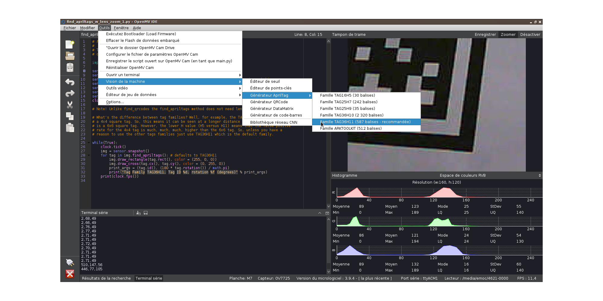

# Communication série entre arduino et openMV

Exemple d'une communication série entre une carte arduino et une caméra programmable [openMV H7](https://openmv.io/) utilisée pour détecter des [april tags](https://april.eecs.umich.edu/software/apriltag.html). La carte openMV envoie des messages donnant l'identifiant et la position en x et y des marqueurs détectés, sous la forme id,x,y.

Du côté arduino, la liaison série se fait sur un port série logiciel à 9600 bauds. La carte arduino replique les messages reçus sur son port série hardware.

## Montage

## Générer des april tags

En utilisant la fonction intégrée à l'IDE openMV, ils sont de type 36H11 (possibilité d'en avoir 587 différents).

__Pourquoi choisir particulièrement cette famille ?__

« *What's the difference between tag families? Well, for example, the TAG16H5 family is effectively a 4x4 square tag. So, this means it can be seen at a longer distance than a TAG36H11 tag which is a 6x6 square tag. However, the lower H value (H5 versus H11) means that the false positive rate for the 4x4 tag is much, much, much, higher than the 6x6 tag. So, unless you have a reason to use the other tags families just use TAG36H11 which is the default family.* »

## Procédure d'installation

* relier arduino et openMV à deux ports USB de l'ordinateur
* connecter la carte openMV (icone dans l'IDE)
* unploader le code openMV (icone dans l'IDE)
* uploader le code arduino
* tester en ouvrant le terminal série arduino, on doit y lire les coordonnées des marqueurs détectés

Si tout fonctionne correctement :
* inscrire comme programme sur la carte (__outils/inscrire le script ouvert sur OpenMV Cam en tant que main.py__)
* «*resetter*» la carte (__outils/réinitialiser OpenMV cam__) (sinon ça ne fonctionnera pas!)
* fermer l'IDE openMV

A partir de là, l'ordinateur n'est plus nécessaire.

## Sources

* l'envoi par openMV mélange les exemples __openmv/arduino/arduino_uart.py__ et __openmv/april tags/find_april_tags_w_lens_zoom.py__ (champ de vision plus petit mais meilleure détection des marqueurs lointains)
* réception série non-bloquante d'après Nick Gammon : https://gammon.com.au/serial
* pour la fonction parsing de chaînes sur arduino : https://arduino.stackexchange.com/a/1237

## Améliorations

SoftwareSerial n'est pas toujours un choix pertinent selon les situations, voir la comparaison entre différentes solutions sur cette page : https://www.pjrc.com/teensy/td_libs_AltSoftSerial.html

une alternative pour la liaison openMV/arduino :  https://github.com/openmv/openmv-arduino-rpc
